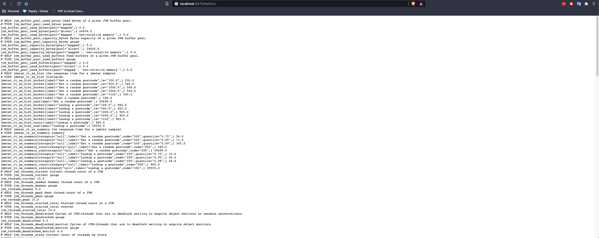
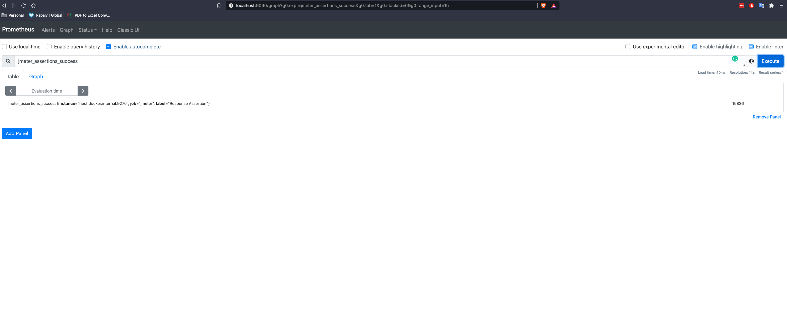
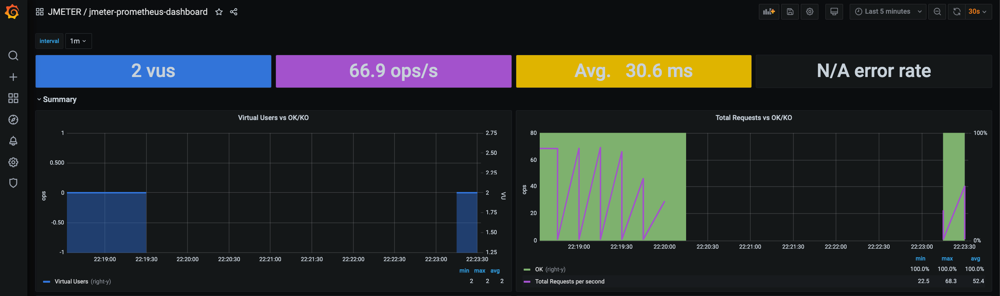
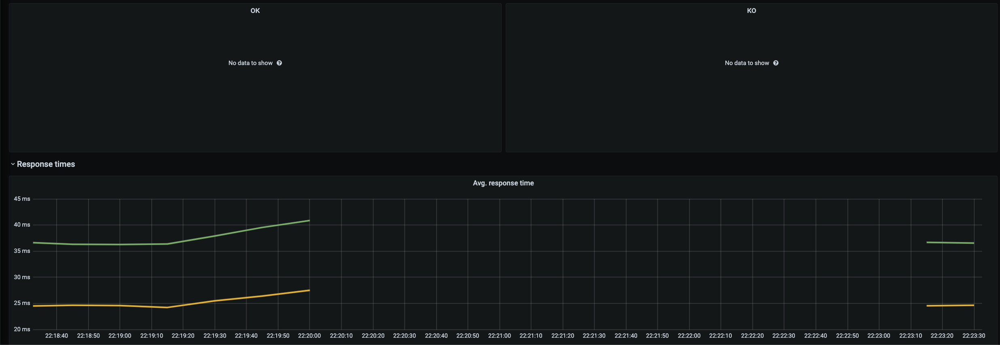
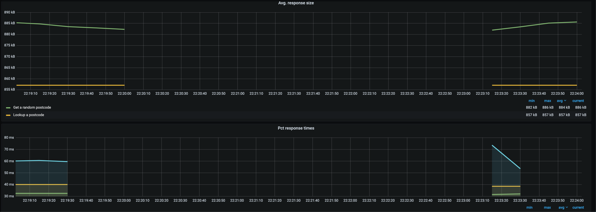
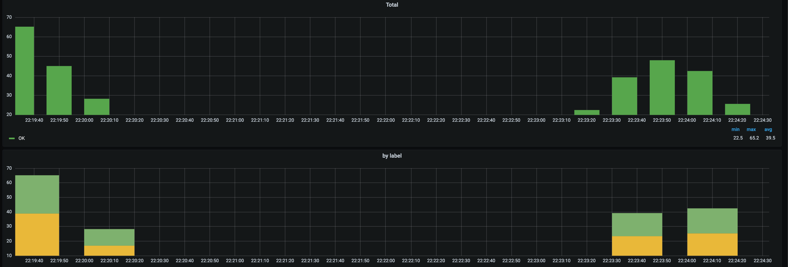

# jmeter-prometheus-grafana-base

Prometheus &amp; Grafana setup ready for JMeter

## Start the both services.

```docker-compose up -d```

```docker ps```

```docker stop prometheus```

## Kill the containers

```docker-compose down```

## Check Prometheus

http://localhost:9270/metrics



http://localhost:9090/graph




## Check Grafana dashboard

http://localhost:3000/

_username/password_: "admin / admin"

  




## Other repo

[jmeter-prometheus-example](https://github.com/beemi/jmeter-prometheus-example)

## :postbox: Contacts

Owner: [beemi.raja@gmail.com](beemi.raja@gmail.com)
